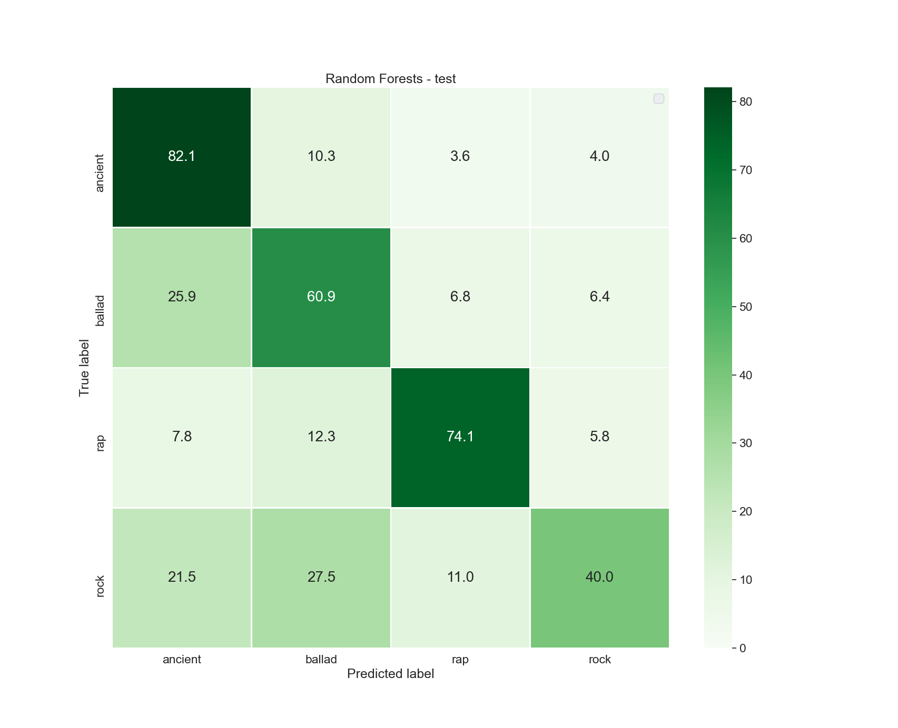

# NLP - 课题六

源代码：

* https://github.com/gpzlx1/Netease-lyrics-spider/tree/master/src
* https://github.com/gpzlx1/Chinese-Sony-Genre-Classification


## 1. 任务介绍

​		从歌词预测音乐类型的研究有很多。不过这些大多是英语。为中文歌曲创建一个语料库，并检查这些技术如何在你的语料库上工作。你不需要开发一种方法，但你需要找到现有的方法并彻底研究它们。

主要挑战：

1. 现有的中文歌词数据集没有流派标注，主要用于中文歌词生成，而不是流派预测分类任务；
2. 相比英文，对于中文的数据预处理更加复杂；
3. 特征提取和分类方法稍多。


## 2. 中文歌词语料库准备

现有的中文歌词语料库主要用于歌词生成(Lyrics Generation)、中文歌词搜索引擎(Search Engine)以及中文歌词翻译（Chinese Lyrics Translations)，都不含歌曲的流派信息，无法直接用于我们小组流派分类任务的探究。为此，我们需要自己准备一个较为完备的中文歌词语料库。基于种种考虑，我们选择通过爬取网易云平台的歌词来构建我们的中文歌词流派语料库。

网易云平台有以下特点：

* 平台相对较为开放，主要的API已经公开且加密算法较为简单或者已被破解；
* 反爬机制较弱，且针对网易云的爬虫教程非常完善；
* 用户基数大，允许用户自行上传歌曲、歌词、歌单等相关信息。

但是网易云平台也有一些问题。我们先介绍下歌词标签的获得。网易云平台并不以歌曲为单位进行任何的流派的标注，而是对歌单（一些列歌曲的集合）进行流派的标注，比如古风、蓝调、忧伤、夜晚、孤独等标注。歌单的创建和相关标注信息都由用户自己上传自己管理，由于每个用户对歌词流派感知不同，且平台提供的标注选项也非常混乱，因而对一个歌单，只能说其中大部分歌曲是可能符合标注信息的。但是经过我们小组认真的分析和比对，我们得出一个假设：**“播放量越高的歌单，其对歌曲的标注信息越得到大家认可，可信度越高”**。我们以下的所有探究都围绕着这个假设展开。

其次，网易云平台作为国内同人歌曲创作的大本营，有着丰富的翻唱文化、同人文化。流行的歌曲，除了最初的官方发行版，还会有大量的翻唱和再创作。虽然他们是不同的歌曲，但是从歌词的角度而言，他们没有本质差别。因而为了提高预料库的质量，非常有必要对爬取的歌词进行去重操作。


###	2.1 歌词爬取

我们选取`古风`、`民谣`、`RAP`、`摇滚`作为我们中文歌词语料库的四大类别。基于**“播放量越高的歌单，其对歌曲的标注信息越得到大家认可，可信度越高”**的假设，选取这四类歌曲主要出于这四类歌曲受众广泛，中文歌曲众多且高播放量的歌单也非常多。我们选取播放量在十万以上的这四类歌单进行爬取，共得到：

* 古风歌曲：55934
* 民谣歌曲：21995
* RAP歌曲：48832
* 摇滚歌曲：43051

我们单独实现了一个**github repo** [Netease-lyrics-spider](https://github.com/gpzlx1/Netease-lyrics-spider) 用于爬取歌词，具体细节这里就不再展开。


### 2.2 歌词清理

原生爬取下来的的歌词含有大量的时间戳信息，歌曲发行信息，版权声明信息。而我们只对歌词部分感兴趣。又基于网易云平台歌曲和歌单特点，在数据清理部分，我们需要完成以下几个任务：

1.	去除歌词时间戳信息
2.	去除歌词的发行信息
3.	去除歌词的版权声明
4.	去除不是非常重要的标点符号
5.	繁体歌词化为简体歌词
6.	去除外文歌，保留中文歌
7.	歌词去重

去除歌词时间戳信息：

* 歌词的时间戳提供了歌曲播放时显示歌词的定位信息，其有统一的格式`[XX:XX.XX]`，因而可以直接借助正则表达式去除。

  ```python3
  lyric = re.sub(r"\[.*\]", "", lyric)
  ```

去除歌词的发行信息：

* 歌曲的发行信息包括作词、演唱、配乐等相关信息。经过大量统计，主要的格式时 `XX [:：] XX`，前一个`XX`为工作，后一个`XX`为人名。因而，我们也可以通过正则去除发行信息。

  ```python3
  lyric = re.sub(r'[^\n].*[:：].*\n', '', lyric)
  ```
  该正则也会去除歌词中如`合唱：`、`独唱：`等相关信息，这些信息本身并不属于歌词的一部分，应该被去除。

去除歌曲的版权声明：

* 歌词中有时还会包括版权声明，其主要形式为`(.*)`。需要注意的是，一般歌词的副歌部分也会以`(.*)`方式呈现。考虑到存在副歌歌歌曲不多，且副歌歌词占全部歌词比重不大，因而一并去除问题不大。最终，我们也通过正则去除版权信息和副歌信息

  ```python3
  lyric = re.sub(r'[(（].*[)）]', '', lyric)
  ```

去除不是非常重要的标点符号:

* 用于标点符号一般不能提供非常有效的信息，我们也决定去除，同样通过正则表达式的方式。

  ```python3
  lyric = re.sub(r'[^\u4e00-\u9fa5\nA-Za-z0-9 ]', ' ', lyric)
  ```

繁体歌词化为简体歌词:

* 繁体歌也被视为中文歌，为减轻后面分类识别所用字典的大小，我们需把繁体歌词化为简体歌词。这里参考[PyDataPreprocessing](https://github.com/bainingchao/PyDataPreprocessing)实现了繁体字化简体字。

去除外文歌，保留中文歌：

* 经过上述操作，我们基本完成对单首歌词的清洗。但，语料库中可能还是夹杂中大量英文歌词。为此，我们仅保留其中中文字符超过30，且中文占比超过百分之五十的歌词。通过这一判定，可以确保几乎所有歌曲都是中文歌。

歌词去重：

* 网易云存在大量的同人歌曲，虽然歌曲不同，但是歌词是一样的，我们对语料库进行去重操作。这里采用一种相对简单的去重方法：
  1. 统计所有歌曲中出现过的所有中文字符,得到一个中文字符集`C`；
  2. 用一个`len(C)`维的歌词向量`Vec`对歌词进行表示，其中`Vec[i]`为中文字符`C[i]`在这个歌词中出现的次数；
  3. 计算所有歌词向量`Vec`之间的余弦值；
  4. 对于相互之间余弦值在0.8以上的歌词向量结合`Set_Vec`，仅保留其中一首歌曲，丢弃其他所有歌曲。
  5. 重复上述操作，直到两两歌词向量之间余弦值小于0.8。

通过上述一系列数据清洗，最终得到：

* 古风歌曲：23,303
* 民谣歌曲：10,797
* RAP歌曲：8,087
* 摇滚歌曲：7,738


### 2.3 中文分词

与拉丁语系不同, 中文的空格并不是一个很好的分割标准, 我们往往需要特别的分词工具将中文句子分割成细粒度的词. 在实验当中, 我们采用`jieba`中文分词工具, jieba分词可以高效的进行词图扫描, 并使用动态规划寻找可能性最大的切分组合. 分词结束后, 我们去除了词频数前200中的无意义词, 并用[百度停用词表](https://github.com/YueYongDev/stopwords/blob/master/%E7%99%BE%E5%BA%A6%E5%81%9C%E7%94%A8%E8%AF%8D%E8%A1%A8.txt)进行了第二次过滤.


### 2.4 数据划分

我们讲49,922歌曲划分中训练集和测试集。其中测试集共四千首，每个流派的歌曲随机选取一千首；剩下的45,922首划分为训练集。之后的所有的分类方法都基于此固定的训练集和测试集，不再调整。


## 3 各种分类方法的实现和探究

 总的一个实验结果如下表：

| method                   | Train ACC | Test ACC  |
| ------------------------ | --------- | --------- |
| 朴素贝叶斯 (Naive Bayes) | 76.3%     | 67.9%     |
| 随机森林 (Random Forest) | 99.5%     | 64.3%     |
| 逻辑回归 (LR)            | 70.1%     | 62.2%     |
| **TextCNN**              | **79.1%** | **70.5%** |
| FastText                 | 66.1%     | 67.1%     |


### 3.1 传统机器学习方法

与神经网络不同, 传统的分类方法往往需要人工设计特征并进行分类. 在这里我们实验了三种模型的分类效果, 分别是朴素贝叶斯, 随机森林, 逻辑回归. 简单对这三种方法进行描述


#### 3.1.1 朴素贝叶斯

歌曲分类任务可以表示为
$$
\arg \max_{c} \mathbf{P}[c | s ]
$$
其中, $c$ 表示可选的歌曲类别, 在我们的实验中为古风, 摇滚, 说唱, 民谣之一, $s$代表歌曲. 如果对上述概率表达式进一步通过贝叶斯公式展开, 我们有:
$$
\begin{align}
\arg \max_c \mathbf{P}[c | s] &= \arg \max_c \frac{\mathbf{P}[s | c]\mathbf{P}[c]}{\mathbf{P}[s]} \\
&= \arg \max_c \mathbf{P}[s | c]\mathbf{P}[c]

\end{align}
$$
我们可以通过数据集对上述两个概率: $\mathbf{P}[s|c]$, $\mathbf{P}[c]$进行估计. 

直观的, $\mathbf{P}[c]$可以估计为训练集当中不同类别的歌曲数的占比. 而对$\mathbf{P}[s|c]$, 朴素贝叶斯方法则做出了简单的假设:
$$
\mathbf{P}[s | c] = \prod_{w \in s} \mathbf{P}[w | c]
$$

其中$w$为歌曲$s$中的词, 或者字. 可以看到, 这样的假设忽略了$w$的顺序, 但对计算要求大大降低.


#### 3.1.2 随机森林

随机森林算法属于集成学习中的Bagging(**B**ootstrap **ag**gregation), 它是通过多个弱决策树组成的分类模型. 对于决策树算法这里不再赘述, 详情参考[wiki](https://en.wikipedia.org/wiki/Decision_tree#:~:text=A%20decision%20tree%20is%20a%20flowchart%2Dlike%20structure%20in%20which,taken%20after%20computing%20all%20attributes). 决策树算法可以理解为一系列 if-else 判断的过程, 其优点是解释性强, 拟合性强, 但是缺点在于容易过拟合, 在训练集上过度拟合, 到时其模型对噪声的抵抗性差. 而随机森林则是通过多个决策树算法改善了这个问题.

具体而言, 随机森林设置有多个决策树模型, 在训练时, 每个决策树只通过随机采样的部分模型进行训练, 这样子不同的决策模型对数据的拟合方面各具特色, 从而综合起来的决策抗噪音能力比单个决策树模型好.


#### 3.1.3 逻辑回归

逻辑回归最开始用于二分类问题当中, 通过假定数据的分布符合多元高斯分布可以推导出分类模型为:
$$
\mathbf{P}[\mathbf{s} = 1] = \frac{1}{1 + \exp(\mathbf{ws} + \mathbf{b})}
$$
我们也可以理解为是对两类数据之间的分割超平面的拟合. 这个公式很自然的可以扩展到多平面当中, 有:
$$
\mathbf{P}[\mathbf{s} = i] = \frac{\exp(\mathbf{w}_i \mathbf{s} + \mathbf{b})}{\sum_{j} \exp(\mathbf{w}_j \mathbf{s} + \mathbf{b})}
$$
本次实验当中我们使用多元交叉熵作为分类损失函数, 梯度下降算法对逻辑回归模型进行优化.


在特征选择上, 我们采用稠密的词向量(或者字向量)作为特征, 特别的, 我们使用word2vec技术得到稠密的表征向量.   通过word2vec得到的向量可以理解为对词((或者字))在低维空间的一种建模, 不同向量具有可比性, 我们可以期望得到这样的结果:
$$
w_{国王} - w_{男人} + w_{女人} = w_{皇后}
$$
其中, $w_{国王}$代表词“国王”的词向量, 同理$w_{男人}$, $w_{女人}$, $w_{皇后}$.

自然的, 通过词向量表征歌曲的方法可以使用歌曲当中所有词向量(或者字向量)的平均, 加和等做法, 得到的歌曲向量也是在同一空间下具有可比性的.


#### 3.1.4 实验结果与分析

* **实验设置**

  对于随机森林, 逻辑回归的特征, 我们使用歌曲分词(或者分字)之后的向量平均作为歌曲的特征表征. 实际使用word2vec训练表征向量时, 我们只选择出现次数大于3次的词或者字进行训练, 使用Skip-Gram以及Negative Sampling技术训练.  对于随机森林, 我们选择了100个弱分类起. 对于逻辑回归, 我们分别使用了`sklearn`的实现以及我们基于`PyTorch`的实现, 由于结果相差无几, 选择`sklearn`的实现进行汇报.

* **结果**

  * **朴素贝叶斯**(Naive Bayes): 我们使用朴素贝叶斯在训练集上可以达到 76.3% 的准确度,  测试集上有67.9%的准确度.

  * **随机森林**(Random Forest): 随机森林在训练集上可以达到99.5%的准群度, 在测试集上有64.3%的准确度.

  * **逻辑回归**(LR): 逻辑回归在训练集上可以达到70.1%的准确度, 在测试集有62.2%的准确度

    

    我们统一给出这三种模型在测试集上的混淆矩阵:

    <div>
    
    
    
    </div>
    

从准确度的角度来说, 朴素贝叶斯在这三种分类方法当中在测试集上表现最好. 为什么结合了word2vec的分类器效果不如简单的朴素贝叶斯? 我们认为其中的原因有:
* 训练语料库较小, 绝大部份的词或者字未能得到很好的训练, 进而无法表征信息, 我们对训练语料库进行了统计, 原数据集有总共29万独特的词, 但是有18万的词出现次数低于3次. 在word2vec训练时, 我们丢弃了这18万左右的词, 相比于贝叶斯, 在推理的时候逻辑回归和随机森林未能利用这些长尾的词的信息

* 特征选择较为简单, 这点我们尝试了添加行数信息, 字数信息, 性能未能提升.

其次, 从混淆矩阵当中我们可以看到, 三类方法对rock类别的预测能力显著低于其余的方法, 我们进行了进一步的分析。

* rock类别和其余类别具有高度的词的重合, 于ancient类别, ballad类别, rap类别的重合的词的占rock类别的词的比例分别为96.6%, 96.9%, 95.6%。这部分反应为什么rock类别在基于朴素贝叶斯等方法上不能达到很好的预测效果。
* 三种方法当中, rock最容易被误认为ballad, 我们进一步统计了不同类之间的重合词的词频分布的差距, 在使用均方损失函数衡量两个分布的差距时, 我们发现rock类与ballad类的分布最为接近, 这也符合我们的观察。至于为什么将ballad类错误预测为rock类要明显少于将rock类错误预测为ballad类, 是因为ballad类与rock类重合的词仅占81%。
* 我们同时再用这三种方法对分字进行了实验, 但结果普遍不如分词。由于以字去区分歌曲的话, 不同字之前的顺序关联性是十分强的, 而我们采用的方法并不能对这样的顺序进行建模, 比如朴素贝叶斯等. 同时, 相比于词, 单个字语义相比于词更多变, 这三种基于固定特征的方法利用字来分类的效果也是很难保证的


### 3.2 深度学习方法

除了实现和研究传统的机器学习办法，我们还研究了一些使用深度学习方法。这里采用了两个非常经典的模型`TextCNN`和`FastText`。


#### 3.2.1 TextCNN

* 模型基本原理

  **Yoon Kim**在论文[(2014 EMNLP) Convolutional Neural Networks for Sentence Classification](https://arxiv.org/abs/1408.5882)提出TextCNN。将**卷积神经网络CNN**应用到**文本分类**任务，利用**多个不同size的kernel**来提取句子中的关键信息（类似于多窗口大小的ngram**）**，从而能够更好地捕捉局部相关性。

  

  TextCNN详细过程：

  * **Embedding**：第一层是图中最左边的7乘5的句子矩阵，每行是词向量，维度=5，这个可以类比为图像中的原始像素点。
  * **Convolution**：然后经过 kernel_sizes=(2,3,4) 的一维卷积层，每个kernel_size 有两个输出 channel。
  * **MaxPolling**：第三层是一个1-max pooling层，这样不同长度句子经过pooling层之后都能变成定长的表示。
  * **Full Connection and Softmax**：最后接一层全连接的 softmax 层，输出每个类别的概率。


* 实验探究

  对于TextCNN我们做了字词的对比，balance dataset和 unbalance dataset的对比（balance dataset即指训练集中四类歌曲数目相同）。固定`batch-size=128, lr=0.0001, epoch=30`，结果如下表：

  | Model-Word?-balance?   | Train ACC  | Test ACC   |
  | ---------------------- | ---------- | ---------- |
  | TextCNN-True-True      | 0.8371     | 0.6695     |
  | **TextCNN-False-True** | **0.7914** | **0.7053** |
  | TextCNN-True-False     | 0.8552     | 0.6398     |
  | TextCNN-False-False    | 0.8088     | 0.6790     |

  我们可以简单的得出结论，字比词的效果好，balance dataset 比 unbalance dataset效果好。

  * 字比词的效果好的主要原因是，TextCNN本身就捕捉的n-gram的相关信息，但是使用词会导致字典变得非常庞大（达到28w，相比字仅为7k)。导致embedding层的训练变得非常稀疏，无法得到非常好的embedding的效果。由于embedding层训练的稀疏性，还易导致模型对训练集数据的过拟合，在测试集上效果不是非常好。

  * balance dataset比unbalance dataset效果好，最主要的原因是balance dataset训练集的数据分布和测试集的数据分布有较高的一致性，提升了模型的在测试集上的泛化能力。

    <div>
    
    
    </div>
    
    


#### 3.2.2 FastText

* 模型基本原理

  

  FastText由三层组成，分别为：

  * 输入层：多个单词以及n-gram特征，这些特征表示单个文档

  * 隐含层：对多个词向量的叠加平均

  * 输出层：一个特定的target

  fastText的核心思想就是：将整篇文档的词及n-gram向量叠加平均得到文档向量，然后使用文档向量做softmax多分类。

  

* 实验探究

  由`TextCNN`可知，在`batch-size=128, lr=0.0001, epoch=30`条件下使用**字为单位**的balance数据集效果最好。因而对 FastText的探究直接继承这些设置，探究`n-gram`对`FastText`的影响。

  | Gram-level  | Train Acc  | Test Acc   |
  | ----------- | ---------- | ---------- |
  | 1gram       | 0.6458     | 0.6510     |
  | **1-2gram** | **0.6610** | **0.6710** |
  | 1-3gram     | 0.7356     | 0.6683     |
  | 1-4gram     | 0.7963     | 0.6650     |

  对于`FastText`而言，`gram-level`对模型的影响并不是非常大。主要原因是，训练数据太少使得`FastText`的几个embedding层无法得到非常有效的训练，使得其能很好的表示歌词信息。`FastText`效果甚至比`TextCNN`效果还差。
  
  <div>
  
  </div>


### 3.2. 横向对比

神经网络的设计能天然提取n-gram的信息，因而并不是非常依赖词的特征，在小数据集上使用词特征，反而会导致训练过程中embedding层非常稀疏，容易对训练数据集过拟合。但是传统的机器学习方法，则相对不能非常有效的提取n-gram信息，歌词的特征表达比较依赖分词结果。对传统的机器学习办法，词的效果比字好。

虽然在所有模型中，使用`TextCNN`能达到最好的分类效果，即使使用预先训练好的词嵌入作为特征向量，NN的训练时间也非常高。如果我们不是非常追求高精度但追求及时性，传统的机器学习方法可能更合适。


## 4. 结论

基于课题六，我们准备了一个中文语料库，实现了几种非常经典的分类算法，并探究其相关特性。从我们开发的模型和我们进行的实验来看，神经网络模型与其他模型相比表现得更好。然而，NN的训练时间也非常高，如果愿意为了时间牺牲一点点精度，传统的机器学习办法也非常具有竞争力。传统的机器学习方法对词的效果更好，而深度学习则偏向于字。上述的一些列实验，也表明了，网易云平台的标注信息也相对混乱，`摇滚`和`民谣`似乎并没有明确的界限。还有很多事情可以进一步探究，比如更好的数据预处理。为每个类型类添加更多的数据。此外，我们可以训练一个更复杂的模型，如使用LSTM，在我们的训练数据上进行实验。


## 5. Reference

https://github.com/ianscottknight/Musical-Genre-Classification-of-Song-Lyrics

https://github.com/alexTsaptsinos/lyricsHAN

https://github.com/dipayandutta93/Music-Genre-Classification-using-lyrics

https://zhuanlan.zhihu.com/p/32965521

https://www.cnblogs.com/bymo/p/9675654.html